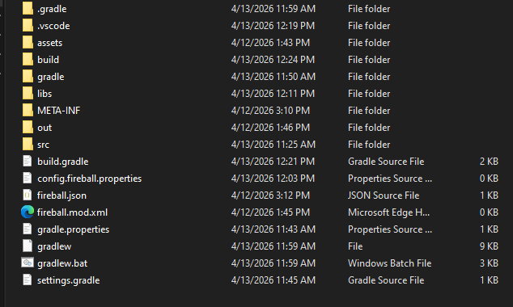

# Fireball Documentation / Guide to Succsess
<p>A guide to succsess of coding fireball mods and understanding fireball itself.</p>
Caution: This tutorial is unfinished and is under construction. You may follow the tutorial and report if something's wrong.
<br>
<br>

<details>
<summary><b>You'll learn</b></summary>
How to make a mod (Making your first mod)<br>
How to make your <strong>mods API</strong> (Making API for your mod / Making your first mod)<br>
What is fireball (introduction)<br>
What is needed to make a mod (introduction)<br>
How <strong>addons</strong> are made within the <strong>mod</strong> (Making your first addon to your mod) <br>
How to make an <strong>addon</strong> (Making your first addon to your mod)<br><br>

</details>
<details>
<summary><b>You'll have</b></summary>
Your first mod made with fireball (and Addon),<br>
Your first mod API, <br>
Knowledge about Fireball.
<br><br>
</details>

# Introduction
## What is fireball?
<p>Fireball is an modloader, that loads mods (every modloader does it), boosts fps and tps. - thereaLabji</p>
Well the answer is right above this text. 

## What is needed to make a mod?
| Name | Required | Optional |
|---|---|---|
| Java, Gradle | X | - |
| Minecraft 1.20.1 | X | - |
| Java, Kotlin, KubeJS | X | - |
| Fireball tools | - | X |
| Gravel | - | X |

| Version  | Name | Minecraft Version |
|---       |---   |---                |
| 17 & 21  | Java |1.20 -> 1.20.6     |
| below 17 | Java |below 1.19.4       |

## Making your first Fireball Mod
Here is an example of my screenshot: <br>

<br>
<span style="font-size:15px;">The attached screenshot has the correct mod setup for fireball.</span>
<br><br>
The `build` folder is used by gradle (for building the mod ofcource) <br>
The `out` folder has your Mod in it (if you bundle the mod) <br>
The `src` folder is where your mod will be coded (com/examplemod/example) <br>
`fireball.json` contains Fireball mod configurations that you can edit, modify or delete. <br>
`fireball.mod.xml` contains your Mod info for gravel.
<br><br>
Inside example: <br>
<br>
<span style="font-size:15px;">Each folder has its own Port.java file, not in the assets folder!</span><br>
And there it is, the `ExampleMod.java` file.
<br>
There should be this code: <br>
```java
package com.examplemod.example;

import org.fireball.api;
import net.minecraft.*;

public class ExampleMod implements ModInit {
    @Override
    public void onInitalize(){
        @mixin.init(minecraft, launch());
        System.out.println("Mod Initalized!");
    }

    @Override
    public void onStartup(){
        // Register code on startup
        reginit({
            // Your code here!
        });
    }
}
```
<br>

## Gradle
If you have gradle, you will have: <br><br>

<span style="font-size:16px;">This attachment has Gradle set-up and an IDE is used (vscode)</span>

# End 
TODO: add more later <br><br>
<b>Guide from thereaLabji himself</b><br><br>2026 (c) Reserved by Secrip Europe
